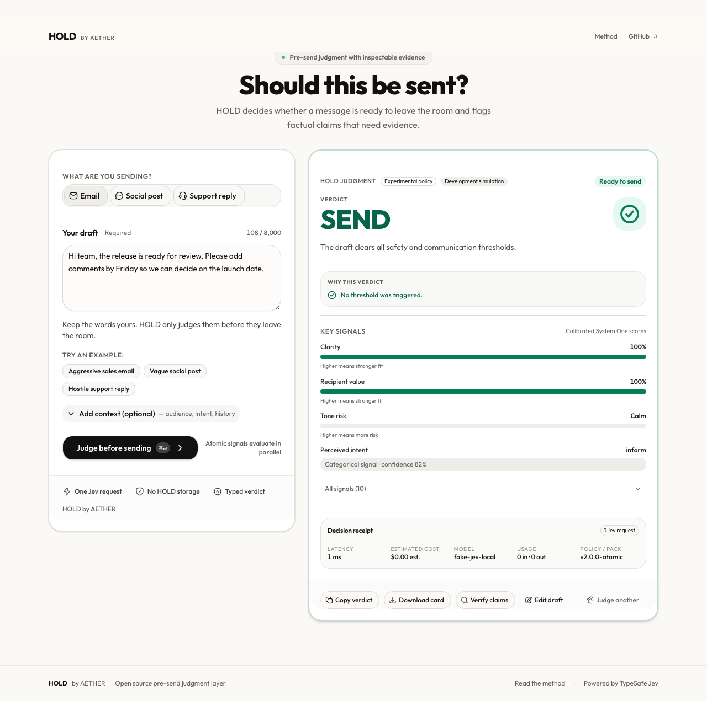

# HOLD by AETHER

> AI can write the message. HOLD decides whether it is ready to leave the room.

HOLD is an open-source pre-send judgment layer for `email`, `social-post`, and `support-reply`. Paste a draft, add optional audience or conversation context, and receive a deterministic `SEND`, `REWRITE`, `HOLD`, or `BLOCK` verdict from atomic TypeSafe Jev signals. HOLD does not generate or rewrite prose.



## Product contract

The communication verdict and Evidence status are independent:

| Communication | Meaning |
| --- | --- |
| `SEND` | No configured policy threshold is triggered. |
| `REWRITE` | A communication fit, clarity, value, tone, spam, intent, or request problem should be fixed first. |
| `HOLD` | A consequential or uncertain claim, missing signal, or evidence concern needs human review. |
| `BLOCK` | A credential/private-data exposure or severe hostility threshold is crossed. |

| Evidence | Meaning |
| --- | --- |
| `NOT_NEEDED` | No checkable claim was selected and verification was not requested. |
| `SUPPORTED` | Retrieved relevant authoritative sources support the claim without material contradiction. |
| `DISPUTED` | Retrieved relevant authoritative sources materially contradict the claim. |
| `MIXED` | Meaningful support and contradiction both appear. |
| `INSUFFICIENT` | Search completed but evidence was weak or irrelevant. |
| `UNAVAILABLE` | Provider failure prevented a trustworthy result. |

Evidence never silently replaces the communication verdict. Disputed or mixed evidence is at least `HOLD`; unavailable or insufficient evidence cannot upgrade a verdict to `SEND`.

## Architecture

```text
Browser composer
  └─ POST /api/evaluate ── one batched Jev request ── atomic signals
                              └─ pure TypeScript policy ── communication verdict

Optional user action or claim signal
  └─ POST /api/evidence
       ├─ bounded local sentence candidates
       ├─ one Jev Noul + Choice + Score claim-selection request
       ├─ one Jev Choice query-selection request over bounded candidates
       ├─ speculative original + selected-query search lanes
       ├─ canonical URL/title deduplication and source validation
       ├─ one batched Jev Noul rerank request
       └─ versioned evidence policy and inspectable source links
```

`packages/jev-provider` is the only communication module that imports `@typesafe-ai/sdk`. `packages/evidence` owns provider-neutral claim selection, search, reranking, and evidence policy. TypeSafe credentials remain server-only. Provider response bodies, drafts, selected claims, and queries are never logged or placed in public URLs.

## Local setup

Requirements: Bun `1.4.2` and Node.js `20+`.

```bash
bun install --frozen-lockfile
cp .env.example .env.local
bun run dev
```

For local UI work without external credentials, opt into the visibly labeled simulation:

```bash
HOLD_PROVIDER=fake bun run dev
```

Fake mode is rejected when `NODE_ENV=production` or `VERCEL_ENV=production`; production never falls back to fixture judgments. Without an explicit fake selection, a missing real key returns `503 provider_not_configured`.

## Environment variables

Real communication judgment:

```bash
HOLD_PROVIDER=typesafe
TYPESAFE_API_KEY=ts_...
TYPESAFE_DEFAULT_MODEL=jev-latest
```

Evidence (when enabled):

```bash
HOLD_EVIDENCE_ENABLED=1
EVIDENCE_SEARCH_URL=https://your-configured-search-adapter.example/search
EVIDENCE_SEARCH_API_KEY=...
```

Public production protection requires a configured Upstash Redis limiter, a non-default salt, and an explicit spending ceiling:

```bash
UPSTASH_REDIS_REST_URL=https://...
UPSTASH_REDIS_REST_TOKEN=...
HOLD_RATE_LIMIT_SALT=long-random-secret
HOLD_RATE_LIMIT_REQUESTS=30
HOLD_RATE_LIMIT_WINDOW_SECONDS=60
HOLD_DAILY_SPEND_USD=10
HOLD_EVIDENCE_DAILY_SPEND_USD=2
HOLD_EVIDENCE_HOURLY_SPEND_USD=1
HOLD_ESTIMATED_COST_PER_REQUEST_USD=0.01
```

See [.env.example](./.env.example) for the complete list. External providers control their own retention; “not stored by HOLD” does not mean the TypeSafe or search provider retains nothing.

## Deployment requirements

Before exposing a deployment publicly, configure a real TypeSafe key, Upstash Redis URL/token, a long random rate-limit salt, positive request and spend ceilings, and—when Evidence is enabled—an HTTP(S) search adapter plus an evidence-specific daily or hourly ceiling. The default spend guard is process-local; distributed deployments need a shared budget control. `HOLD_PROVIDER=fake` is for explicitly selected development/test environments only.

## Calibration and live Jev verification

Human labels live separately in [`calibration/hold-calibration-v2.json`](./calibration/hold-calibration-v2.json). The live suite runs the critical smoke gate plus the 60-case calibration fixture, asserts every expected smoke verdict, requires one Jev request per communication evaluation, and reports agreement, per-verdict agreement, a confusion matrix, critical false negatives, uncertain cases, p50/p95 latency, token usage, estimated cost, model, question-pack version, and policy version.

Live tests are intentionally skipped in ordinary local runs when no real key is available. A skipped live run is not production verification:

```bash
RUN_LIVE_JEV=1 HOLD_PROVIDER=typesafe TYPESAFE_API_KEY=ts_... bun run test:live-jev
```

Evidence requires its explicit feature flag and search adapter credentials:

```bash
RUN_LIVE_EVIDENCE=1 HOLD_PROVIDER=typesafe HOLD_EVIDENCE_ENABLED=1 \
  TYPESAFE_API_KEY=ts_... EVIDENCE_SEARCH_URL=https://... EVIDENCE_SEARCH_API_KEY=... \
  bun run test:live-evidence
```

The protected/manual GitHub workflow uploads the report and does not run on untrusted fork pull requests.

## Security, privacy, and limitations

- TypeSafe SDK use is server-only; `TYPESAFE_API_KEY` never reaches browser code.
- HOLD validates byte limits, rejects unsafe Evidence URLs, escapes share-card SVG text, and never renders provider HTML.
- Rate limits use a fixed window whose TTL is set only when the key is created. Communication, Evidence, and reranking buckets are separate.
- A server-side spending guard refuses expensive work before it begins when request or spend ceilings are reached; it never silently downgrades to fake data.
- The default spending guard is process-local; distributed deployments should add a shared budget control before public exposure.
- Communication judgment sends the draft, context, and supplied audience/intent/conversation context to TypeSafe. Evidence claim selection sends the draft and bounded sentence candidates to TypeSafe; query selection and reranking send only the selected claim, bounded query candidates, and source metadata to TypeSafe. The configured search provider receives only the selected search query, not the draft or optional context.
- HOLD itself does not persist drafts, results, claims, queries, raw IPs, or analytics payloads. API responses are `no-store`; there are no permanent result URLs, public metadata, or default share-card claim/draft fields. External providers control their own retention.
- Retrieved snippets are evidence pointers a human can inspect. They are not proof, and HOLD is not a fact-checking oracle, legal reviewer, security boundary, or sending agent.

Read [`SECURITY.md`](./SECURITY.md) and the transparency page at [`/method`](./app/method/page.tsx) for the policy details.

## Checks

```bash
bun install --frozen-lockfile
bun run typecheck
bun run lint
bun run lint:biome
bun test
bun run build
bun run test:e2e
git diff --check
```

With credentials, also run `bun run test:live-jev` and `bun run test:live-evidence`. Browser checks should cover desktop 1440×900 and 1280×800, mobile 390×844, light/dark themes, 200% zoom, keyboard-only operation, and reduced motion.

## Contributing

See [`CONTRIBUTING.md`](./CONTRIBUTING.md). Use synthetic calibration cases only; never commit real credentials or private communications. Every question-pack or policy change needs an independently authored fixture/test update.

## License and attribution

HOLD by AETHER is released under the [Apache License 2.0](./LICENSE). TypeSafe Jev is accessed through the MIT-licensed `@typesafe-ai/sdk`. Reused UI components retain their package attribution and license terms.
The `components/ui` layer follows the MIT-licensed shadcn/ui component distribution and uses Base UI primitives; upstream dependency licenses remain authoritative in the installed package metadata.

## Manual GitHub launch checklist

The repository metadata is intentionally not mutated by this task. Before launch, configure:

- description: “Open-source pre-send judgment and inspectable evidence for messages”;
- homepage and demo URL;
- a current social preview using the real screenshot;
- topics: `typesafe-ai`, `jev`, `system-one`, `decision-ai`, `semantic-reranking`, `evidence-search`, `nextjs`, `typescript`, `shadcn-ui`, `open-source`;
- Discussions if maintainers want public calibration feedback;
- a first tagged release and launch issue.
